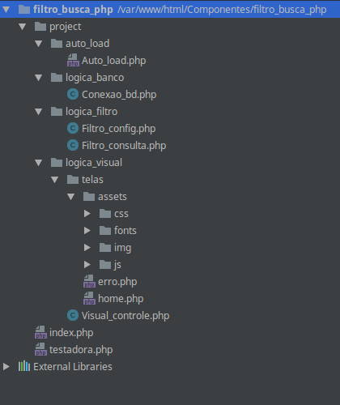
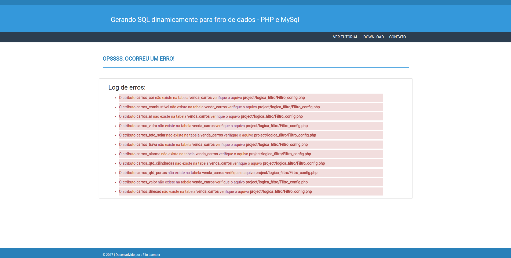
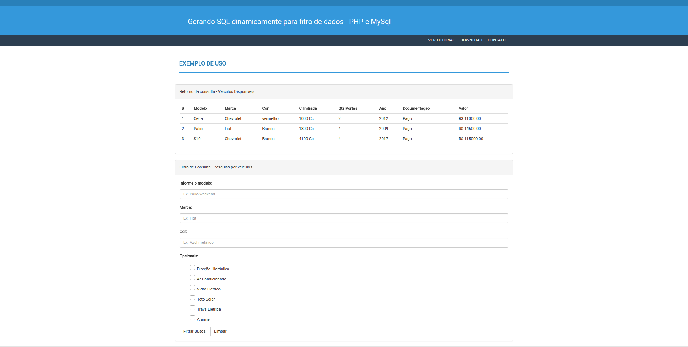

# Filtro de dados com php

<h3>Gerando SQL dinamicamente para fitro de dados com PHP.</h3>

   <b>- Funcionamento:</b>
     Ao criar um formulário de busca, se faz necessário lidar com as informações inseridas pelo usuário no filtro e a partir        desses dados, devemos converter em uma consulta na base de dados. No caso deste exemplo, o código deverá receber os dados        via "POST" e armazená-los dinâmicamente em um vetor, logo após, as informações recebidas serão passadas como argumento para      o método responsável por gerar a consulta "SELECT" no banco de dados. Obs: Sei que "n" frameworks já realizam muito bem este trabalho, porém estou reinventado a roda com finalidade de aprender mais solidificar conceitos. ;)

  <b>- Estrutura de pastas do exemplo:</b>  
  

 
 

  <b>- Classe "Filtro_config.php":</b>  
  <pre>
<code>
namespace project\logica_filtro;

class Filtro_config {

	public function regra_filtro(){

		#retorna array contendo dados das tableas a serem trabalhadas.
		return [

				#recebe tabelas do banco de dados.
				'tabelas' => array(
					
					#recebe a especificação da tabela.
					'venda_carros' => array(

							 #recebe lista de atributos.
							 'atributos' => array(

							 		 "carros_marca" => array(

							 			"tipo" => "varchar",
							 			"tamanho" => 10,
                                        "html_att_name" => "marca"

                                     ),

							 		 "carros_modelo" => array(

							 			"tipo" => "varchar",
							 			"tamanho" => 15,
                                        "html_att_name" => "modelo"

                                     ),

							 		 "carros_ano" => array(

							 			"tipo" => "int",
							 			"tamanho" => 11,
                                        "html_att_name" => ""

                                     )
                                 //outros atributos...
                             )
						)

					//outras tabelas...

					)
			];
	}
}
</code>
</pre>
   
  Nesta classe, deve ser inserido no array o nome das tabelas que deverão ser consultadas no filtro. Este array será utilizado para verificar se a tabela e atributos passados como argumento no arquivo "testedora.php" realmente estão corretas. Sendo utilizada também para conferir o tipo de valor a ser armazenado e qual o identificador "name" foi setado no html.

  <b>- Executando o exemplo:</b> 
  <pre>
  <code>
include_once "project/auto_load/Auto_load.php";
use project\logica_filtro\Filtro_consulta as Consulta;

$objData = new Consulta;

#Lista de tabelas que farão parte da consulta.
$tableas_consulta = array(
                        "venda_carros",
                    );

#Lista de atributos que farão parte da consulta (Todos os atributos aqui listados, serão retornados pelo select)
$tableas_atributos_retorno = array(

                            "carros_marca",
                            "carros_cor",
                            "carros_ar",
                            "carros_vidro",
                            "carros_teto_solar",
                            "carros_trava",
                            "carros_alarme",
                            "carros_qtd_cilindradas",
                            "carros_qtd_portas",
                            "carros_ano",
                            "carros_valor",
                            "carros_modelo",
                            "carros_direcao"
                            );

#ATENÇÃO, TODOS OS VALORES DE INPUT SERÃO ATRIBUIDOS DINAMICAMENTE E ADICIONADOS NA CLAUSULA WHERE
$objData->monta_filtro_select($tableas_consulta, $tableas_atributos_retorno,$limit = 10);
  </code>
  </pre>
   
   A princípio, só é possível realizar o "SELECT" simples com "WHERE" e "AND". Conforme visto no arquivo "Filtro_config.php", foi listado no array a chave "html_att_name", através do seu valor, será recebido o valor do formulário dinamicamente através do "POST".  

 

  <b>- A classe "Filtro_consulta.php":</b>  
 <pre>
   
  * Método monta_filtro_select() :   
 <code>
       public function monta_filtro_select($tabela, $att_retorno = "*", $limit){

          $this->conexao = new Consulta;
          $this->tabela = $tabela;
          $this->att_retorno = $att_retorno;
          $this->limit = $limit;
          $this->array_dados = Filtro::regra_filtro();
          $this->array_entrada_form;

          $this->validacao_filtro_config($this->tabela, $this->att_retorno,$this->array_dados);
          
              #atribui no vetor o valor dos inputs do tipo 'post' de acordo com o att 'name' setado no html de cada elemento, buscando essas informações no Filtro_config
              for($i = 0; $i < count($this->att_retorno); $i++){

                  $this->array_entrada_form[$this->att_retorno[$i]] = filter_input(INPUT_POST,$this->array_dados['tabelas'][$this->tabela[0]]['atributos'][$this->att_retorno[$i]]["html_att_name"]);
              }

          $this->sql = "SELECT ".implode(',',$this->att_retorno)." FROM {$tabela[0]} {$this->monta_where($this->sql,$this->att_retorno,$this->array_entrada_form,$this->limit)}";

          $this->set_visual($this->listaDados($this->sql));
      }

 </code>
 </pre>
    
 Recebe por argumento o nome da tabela, os atributos que deverão ser retornados e o limite de retorno. Realiza uma chamada ao método "validacao_filtro_config()", que será descrito mais abaixo. O array "$this->array_entrada_form", é atribuído com os valores enviados via "POST", através da referência ao name utilizado no "input" do html e salvo no array da classe "Filtro_config.php". Após receber os dados, estes serão passados apara o método monta_where(), que tem por função receber as informações e adicionalas no "WHERE" da consulta e retornar o "SELECT" completo, pronto para ser executado. 
  
  

   
  * Método validacao_filtro_config() :   
  <pre>
  <code>
  private function validacao_filtro_config($tabela, $att_retorno, $array_config){

        $this->html = "";
        $erro = false;
        $this->array_dados = $array_config;

        for($i = 0; $i < count($tabela); $i++){

            #Comparando se a tabela é equivalente a alguma informada no arquivo de configuração. Caso a tabela existir, será conferido os atributos.
            if(array_key_exists($tabela[$i], $this->array_dados['tabelas'])){

                #Recebe os atributos listados na tabela passada como argumento, seguindo a ordem de profundidade do array do Filtro_config.
                $atributos = $this->array_dados['tabelas'][$tabela[$i]]['atributos'];

                if($att_retorno != "*") {

                    for ($cont = 0; $cont < count($att_retorno); $cont++) {

                        if (!array_key_exists($att_retorno[$cont], $atributos)) {

                            $this->html .= "<li class='alert-danger'>" .
                                "O atributo <b>{$att_retorno[$cont]}</b> não existe na tabela <b>{$tabela[$i]}</b> verifique o aquivo <b>project/logica_filtro/Filtro_config.php</b>" .
                                "</li>";

                            $erro = true;
                        }
                    }

                    if($erro == true){
                        $this->logErro($this->html);
                    }
                }

            } else {

                $this->logErro("<li>Valor passado não corresponde a nenhuma tabela!</li>");
            }
        }
      }
      
  </code>
  </pre>
    
  
  Como o nome sugere, este método valida as informações passadas para o gerador do filtro. Verifica se a tabela e atributos passados por argumento conferem com o que foi listado no arquivo de configuração. Caso a tabela ou algum atributo não seja equivalente ao descrito na configuração, será exibido uma página de erro, informando o nome da tablea ou atributo inexistente. Ex:   
  
  
     
  
 
  
  

   * Método monta_where() :   
   <pre>
   <code>
       private function monta_where($sql,$array_att,$att_val,$limit){

          $sql .= " WHERE ";
          $qtd_total = count($array_att);

            for($i = 0; $i < $qtd_total ; $i++){

               #verifica se possui valor adicionado, se não possuir, não adiciona no where.
                if(!empty($att_val[$array_att[$i]])){

                    #verifica se o elemento anterior estava vazio, para poder inserir o AND antes do próximo valor ser inserido no where
                    if($i > 1 && empty($att_val[$array_att[$i-1]])){
                        $sql .= " AND ";
                    }

                    #verificar se a chave de att_val é iqual array_att, dai saberemos se a mesma estará na clausula where
                    $sql .= "{$array_att[$i]} = '{$att_val[$array_att[$i]]}' ";

                    #verifica se existe mais iterações, caso existir, confere se a próxima posição possui valor setado no post.
                    if(($i+1) < $qtd_total && !empty($att_val[$array_att[$i+1]])){

                        $sql .= " AND ";

                    }
                }
            }
          if(!empty($limit)){

              $sql .= "LIMIT " . $limit;
          }
          
            return $sql;
      }
   </code>
   </pre>
     
  
 Recebe como argumento parte do "SQL" gerado no método "monta_filtro_select()", que será concatenado ao restante da consulta após gerado o "WHERE". Também será passado o "$array_att", responsável por armazenar quais os atributos devem ser retornados da consulta e também irá auxiliar como chave para percorrer os valores do array "$att_val", também gerado no método "monta_filtro_select()", recebendo os valores enviados via "POST", por fim, temos o argumento "$limit", que nada mais é que a quantidade máxima de valores que deverá ser retornado da consulta.
 
  
Dentro do for, é verificado se a posição atual do array possui algum valor, caso possuir, é porque este atributo recebeu um valor via "post", assim sendo irá seguir adiante, verificando se a posição anterior do array possui valor, caso não possuir, será adicionado um "AND" a consulta, antes do elemento atual ser adicionado ao "WHERE", pois mais abaixo, podemos ver que o "AND" só é adicionado a consulta, caso o "for" não esteja em sua ultima iteração e que a próxima posição não esteja vazia, pois estando, o "AND" será adicionada nesta primeira verificação.

 
No mais, a cada iteração do for, é adicionado um novo valor ao "WHERE", ex: "AND att = valor", utilizando a posição atual do array "$array_att[$i]" para acessar o valor equivalente a este atributo recebido no "post" e armazenado em "$att_val[$array_att[$i]]". Quando terminar o laço "for", é verificado se algum valor para o "LIMIT" foi passado, caso verdadeiro este valor é adicionado a consulta e logo após a string contendo o "SELECT" completo é retornada e executada pelo método $this->set_visual($this->listaDados($this->sql)), chamada pelo método monta_filtro_select().  A $this->set_visual(), finaliza o processo, executando a query e enviando o resultado já pronto para ser renderizado na visualização.  
 
 
 

  
  

     

 

